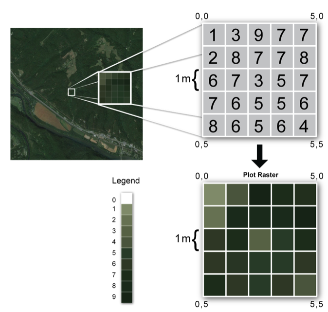

<!-- Estilo del HTML -->
<style type="text/css">
h1 {font-size: 32px;color: #00008B}
h1.title {font-size: 32px;}
h2 {font-size: 30px;color: #4169E1}
h3 {font-size: 26px;color: #4169E1}
h4 {font-size: 24px;}
 p {font-size: 22px; color: black}
li { font-size: 18px;color: black}
.table th:not([align]) {text-align: left;}
</style>

<!-- Configuración de la consola de R -->
```{r setup, include=FALSE}
knitr::opts_chunk$set(echo = T , eval = T , warning = T)
```

# 0. Antes de iniciar la clase ...

### 0.1 Limpiar consola, entorno y fijar directorio de trabajo

Primero limpiemos la consola y la memoria activa de R.
```{r}
cat("\f")
rm(list=ls())
```

Cambiemos el directorio de trabajo por la ruta a la carpeta que contiene la ```Clase 10``` en nuestro equipo:
```{r}
setwd("~/Dropbox/teaching/Taller de R/GitHub/Clases/Clase 10") # Cambiar este directorio
```

Vamos a asegurarnos que estamos sobre el directorio de trabajo correcto. Si escribimos ```getwd()``` sobre la consola, debemos obtener la ruta dentro de nuestro pc que hemos fijado como directorio de trabajo. Si estamos en el directorio correcto, después del ultimo ```/``` debemos observar el nombre la carpeta así:

* ```Clase 10``` (si lo descargas manualmente o creando una versión de control) 
* ```clase_10-master``` (si lo descargas usando la función ```download.file()```)

```{r}
getwd()
```

De igual forma, puedes escribir sobre la consola ```list.files()``` para revisar los archivos que tienes en el directorio de trabajo. Deberías observar estos archivos:

```{r}
list.files()
```

Sino observas estos archivos sobre la consola, deberías fijar el directorio correctamente antes de continuar.

### 0.2 Instalar las librerías de la clase

Vamos a verificar que todos los paquetes que vamos a usar en la clase están instalados en nuestro equipo:

```{r,eval=F}
paquetes = c('tidyverse','rgdal','sf','sp','raster')
for ( paquete in paquetes){
      if ( length(grep(paquete,installed.packages()[,1])) == 0 ){ 
           install.packages(paquete) ; print(paste0("La librería ", "'", paquete ,"'", " ha sido instalada."))}
      else { print(paste0("La librería ", "'", paquete ,"'", " ya está instalada."))}
      rm(paquete)
}
```
Después de correr estas líneas de código, deberíamos observar sobre la consola los siguientes mensajes:

* ```"La libreria 'X' ya está instalada."``` (si ya teníamos instalada la librería) 
* ```"La libreria 'X' ha sido instalada."``` (sino teníamos instalada la librería, pero ya se instaló) 

### 0.3 Llamar las librerías de la clase

Ahora vamos a llamar las librerías que vamos a usar en la clase: 

```{r,eval=F}
sapply(paquetes,require,character.only=T) 
```

## 0.4. Hoy veremos 

### 0.4.1. En la clase anterior vimos

* 1. Operaciones geométricas
* 2. Aplicación

### 0.4.2. Hoy veremos 

* 1. Introducción a datos raster
* 2. Algunas fuentes de datos raster para Colombia y el mundo
* 3. Importar datos raster
* 4. Operaciones geométricas con raster 
* 5. Raster de varios layers
* 6. Aplicacion en clase

# 1. Introducción a datos raster

* Un raster consta de una matriz de celdas (o píxeles) organizadas en filas y columnas (o una cuadrícula) en la que cada celda contiene un valor que representa información. Las fotografías que tomamos con nuestro teléfono móvil son de alguna forma un tipo de raster. Sin embargo, las imágenes satelitales con las que vamos a trabajar en la clase, son recolectadas usando técnicas de teledetección óptica LIDAR (Light Detection and Ranging o Laser Imaging Detection and Ranging) o VIIRS (Conjunto de Radiometros de Imagenes Infrarrojas visibles).

## 1.1. ¿Como se ve un raster?



## 1.2. Atributos de un raster

* Dimensión o numero de filas y columnas, así como el numero de bandas que tiene el raster
* La resolución de cada pixel 
* Tipo de archivo
* CRS
* Información de los pixelex 

# 2. Fuentes de información de datos raster

## 2.1. Luces nocturnas

* Son recolectadas usando VIIRS, uno de los instrumentos que se encuentra a bordo del Suomi National Polar Partnership (SNPP) volado por la National Aeronautics and Space Administration (NASA) y la National Oceanic and Atmospheric Administration (NOAA). Por medio de este instrumento se observa toda la superficie de la Tierra dos veces al día capturando en la Day- Night Band (DNB) la radiación emitida por las luces nocturnas en las ciudades. 

### 2.1.1. Mensuales 2012-2019

Pueden descargarse en [https://ngdc.noaa.gov](https://ngdc.noaa.gov/eog/viirs/download_dnb_composites.html) o en [https://payneinstitute.mines.edu](https://payneinstitute.mines.edu/eog/)

### 2.1.2. Diarias (Últimos 60 días desde la fecha)

Pueden descargarse en [https://ngdc.noaa.gov](https://ngdc.noaa.gov/eog/viirs/download_ut_mos.html)

### 2.1.3. Proyecto DSMP (1992-2013)

Pueden descargarse en [https://ngdc.noaa.gov](https://ngdc.noaa.gov/eog/dmsp/downloadV4composites.html)

### 2.2. Deforestación

### 2.2.1. SIAC

Pueden descargarse en [http://www.siac.gov.co](http://www.siac.gov.co)

### 2.2.1. Hansen

Pueden descargarse en [https://data.globalforestwatch.org](https://data.globalforestwatch.org/datasets/14228e6347c44f5691572169e9e107ad)

### 2.3. GES-DISC

Una de las fuentes de datos raster en el mundo es el *EARTH DATA* de la NASA y puedes descargar los raster en [https://disc.gsfc.nasa.gov](https://disc.gsfc.nasa.gov).
