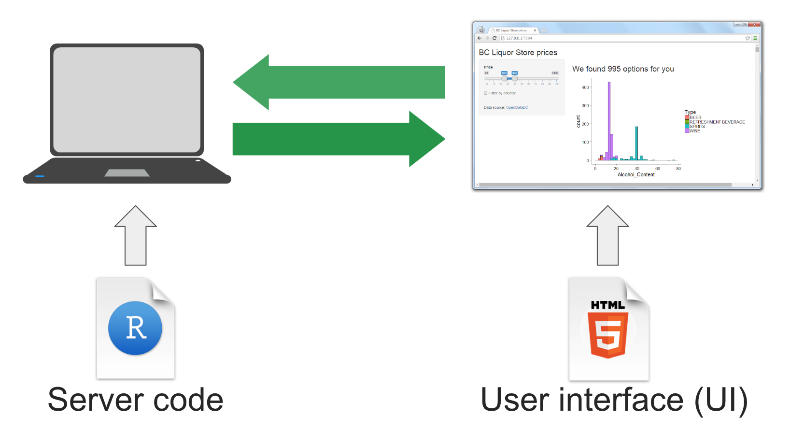

<!-- Estilo del HTML -->
<style type="text/css">
h1 {font-size: 32px;color: #00008B}
h1.title {font-size: 32px;}
h2 {font-size: 30px;color: #4169E1}
h3 {font-size: 26px;color: #4169E1}
h4 {font-size: 24px;}
 p {font-size: 22px; color: black}
li { font-size: 18px;color: black}
.table th:not([align]) {text-align: left;}
</style>

<!-- Configuración de la consola de R -->
```{r setup, include=FALSE}
knitr::opts_chunk$set(echo = T , eval = T , warning = T)
```

# 0. Antes de iniciar la clase ...

### 0.1 Limpiar consola, entorno y fijar directorio de trabajo

Primero limpiemos la consola y la memoria activa de R.
```{r}
cat("\f")
rm(list=ls())
```

Cambiemos el directorio de trabajo por la ruta a la carpeta que contiene la ```Clase 15``` en nuestro equipo:
```{r}
setwd("~/Dropbox/teaching/Taller de R/GitHub/Clases/Clase 15") # Cambiar este directorio
```

Vamos a asegurarnos que estamos sobre el directorio de trabajo correcto. Si escribimos ```getwd()``` sobre la consola, debemos obtener la ruta dentro de nuestro pc que hemos fijado como directorio de trabajo. Si estamos en el directorio correcto, después del ultimo ```/``` debemos observar el nombre la carpeta así:

* ```Clase 15``` (si lo descargas manualmente o creando una versión de control) 
* ```clase_15-master``` (si lo descargas usando la función ```download.file()```)

```{r}
getwd()
```

De igual forma, puedes escribir sobre la consola ```list.files()``` para revisar los archivos que tienes en el directorio de trabajo. Deberías observar estos archivos:

```{r}
list.files()
```

Sino observas estos archivos sobre la consola, deberías fijar el directorio correctamente antes de continuar.

### 0.2 Instalar las librerías de la clase

Vamos a verificar que todos los paquetes que vamos a usar en la clase están instalados en nuestro equipo:

```{r,eval=F}
paquetes = c('tidyverse','data.table', 'kable', 'kableExtra','shiny')
for ( paquete in paquetes){
      if (length(grep(paquete,installed.packages()[,1])) == 0 ){ install.packages(paquete)}
      else { print(paste0('La librería ', '"', paquete ,'"', ' ya está instalada.'))}
      rm(paquete)
}
```
Después de correr estas líneas de código, deberíamos observar sobre la consola los siguientes mensajes:

* ```"La libreria 'X' ya está instalada."``` (si ya teníamos instalada la librería) 
* ```"La libreria 'X' ha sido instalada."``` (sino teníamos instalada la librería, pero ya se instaló) 

### 0.3 Llamar las librerías de la clase

Ahora vamos a llamar las librerías que vamos a usar en la clase: 

```{r,eval=F}
sapply(paquetes,require,character.only=T) 
```

## 0.4. Clase 15

### 0.4.1. En la clase anterior vimos

* 1. Introducción a web-scraping 
* 2. HTML (Hyper Text Markup Language)
* 3. Selector Gadget, xpath y css
* 4. Aplicación (atributos del elemento)
* 5. Aplicación (extraer tablas)  
* 6. Aplicación (extraer datos de lluvias) 
* 7. Aplicación (web drive)

### 0.4.2. Hoy veremos 

* 1. RMarkdown
* 2. Shiny

## 1. Introducción a RMarkdown

### 1.1. ¿Que es R Markdown?

Markdown es un lenguaje de marcado que facilita la aplicación de formato a un texto empleando una serie de caracteres de una forma especial. En R podemos integrar este leguaje para generar informes y documentos automatizados.

### 1.2. Elementos de un archivo .Rdm 

Podemos identificar tres elementos dentro de un archivo .Rdm:

+ Encabezado: Esta parte del .Rdm se encuentra al inicio del documento y está contenido en los siguientes caracteres `---`. Allí se deben escribir todas las funciones que permitan asignar la configuración deseada a mi documento.

+ Texto: Mientras en R el formato primario son las funciones, en R Markdown se considera el texto plano como el formato primario. Al momento de compilar R Markdown lo define como *ordinary text without R code*. 

+ Código: Está compuesto por todas las líneas de código que se ejecutan en la consola de R y que permiten obtener los resultados que se muestran en el *output* del .Rdm. 

### 1.3. Encabezado YAML

Como mencionamos anteriormente, este va al inicio de nuestro documento y determina los parámetros generales del reporte a compilar. 

```
---
title: "Introducción a R Markdown" 
subtitle: "Taller de R, clase 15"
author: "Eduard Martinez"
date: "5/20/2020"
linkcolor: blue
urlcolor: blue
output: html_document
---
```

### 1.4. Hoja de referencia

Clic [aquí](https://rstudio.com/wp-content/uploads/2015/03/rmarkdown-spanish.pdf) para ir a la hoja de referencia de R Markdown.

{width=50%}

### 1.5. Help

Vamos a la pagina de [https://rmarkdown.rstudio.com](https://rmarkdown.rstudio.com/authoring_basics.html) y revisemos las sintaxis básicas de R Markdown. En las siguientes páginas web podemos encontrar material de apoyo que nos sirve para iniciar con R Markdown. 

+ [Bookdown](https://bookdown.org/gboccardo/manual-ED-UCH/introduccion-al-uso-de-rmarkdown-para-la-compilacion-de-resultados-de-rstudio-en-diferentes-formatos.html) 

+ [r4ds](https://es.r4ds.hadley.nz/r-markdown.html)

+ [Bookdown](https://bookdown.org/yihui/rmarkdown/notebook.html#using-notebooks)

+ [kableExtra](https://cran.r-project.org/web/packages/kableExtra/vignettes/awesome_table_in_html.html#CellText_Specification)

### 2. Shiny

Un shiny app o una dashborad es una interfaz de usuario (UI) conectada a una seccion de R corriendo en una computadora (server) 

{width=70%}

### 2.1. Imputs de shiny

{width=70%}


### 2.2. Help


Veamos algunos ejemplos de shiny: [https://github.com/rstudio/shiny-examples](https://github.com/rstudio/shiny-examples)

```
library(shiny)
runExample(example = "04_mpg")
```

Otras galeriias: [https://shiny.rstudio.com/gallery/](https://shiny.rstudio.com/gallery/)

### 2.3. Alojar la app en el servidor de shiny

1. Ir a [https://www.shinyapps.io](https://www.shinyapps.io)

{width=60%}

2. Crean un usuario y una contraseña  (preferiblemente usen el correo de su cuenta de GitHub)

{width=60%}

3. Generen un dominio para su cuenta (yo uso eduard-martinez, el nombre de mi usuario en GitHub)

{width=60%}

4. Obtener un tocken

{width=40%}


