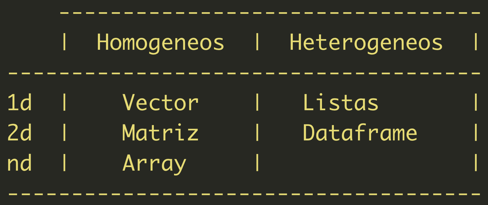

<style type="text/css">
h1 {
  font-size: 34px;
  color: red
}
h1.title {
  font-size: 38px;
}
h2 {
  font-size: 30px;
}
h3 {
  font-size: 24px;
}
h4 {
  font-size: 18px;
}
h5 {
  font-size: 16px;
}
h6 {
  font-size: 12px;
}
p {
 font-size: 16px;
 color: black
}
li {
 font-size: 16px;
 color: black
}
.table th:not([align]) {
  text-align: left;
}
</style>


### En la clase anterior vimos ...

* Interfaz de Rstudio y scripts.
* Conceptos basicos de la interfaz de Rstudio.
* Tipos de datos: entero, numerico, logico y character.

### Hoy veremos ...

* Manejo de la biblioteca y gestión de paquetes
* Trabajar sobre un directorio de trabajo en R
* Estructuras de datos en R

# 1. Manejo de la biblioteca y gestion de paquetes 

* Un paquetes es un conjunto de funciones adicionales a las funciones basicas de R.
* Los paquetes solo se instalan una vez.
* Cuando instalamos el paquete, generalmente queda guardado en: */Library/Frameworks/R.framework/Versions/3.6/Resources/library*
* Cuando el paquete no es base, es necesario cargarlos cada vez que iniciamos seccion en Rstudio y vamos a usar el paquete.
* Cuando solo vamos a usar una funcion especifica, no es necesario llamar todo el paquete
* Nota: por orden, yo prefiero cargar siempre al incio de cada script todos los paquetes que voy a usar en ese script.

### Paquetes instalados 
```{r,eval = TRUE,warning = TRUE,error = TRUE,echo=TRUE}
installed.packages()[1:10,c(1,3,4)]
```


### Esta instalado un paquete? 
```{r}
is.element("dplyr",installed.packages()[,1])
```


### Instalar un paquete
```{no, eval = FALSE,warning = TRUE,error = TRUE,echo=TRUE}
install.packages("dplyr")
```

### Llamar el paquete
```{r}
require('dplyr')
library('dplyr')
```

###  Qu'e pasa cuando el paquete no est'a instalado?
```{r}
require('rgdala')
```

### C'omo unload un paquete que no estoy usando?
```{r}
detach("package:dplyr", unload = TRUE) 
```

### Older version 
```{older, eval = FALSE,warning = TRUE,error = TRUE,echo=TRUE}
require(devtools)
install_version("dplyr", version = "1.0.2", repos = "http://cran.us.r-project.org")
```

### Cuantos paquetes hay disponibles en R?
```{avalible, eval = TRUE,warning = TRUE,error = TRUE,echo=TRUE}
available.packages()[1:10,1:2]
nrow(available.packages())
is.element("ggplot2",available.packages()[,1]) # Saber si un paquete existe
is.element("development",available.packages()[,1]) # Saber si un paquete existe
```

### Eliminar un paquetes 
```{remove, eval = FALSE,warning = TRUE,error = TRUE,echo=TRUE}
remove.packages("dplyr") 
```


# 2. Trabajar sobre un directorio de trabajo en R

El directorio de trabajo es el lugar del dicso duro sobre el que queremos siturnos para trabajar desde R. Fijar un directorio, es de cierta manera acortar la ruta que R debe recorrer para importar/exportar un objeto.

</img>

Tomado de: [https://www.freepik.es/](https://www.freepik.es/vector-premium/juego-laberinto-laberinto_2416974.htm)


### Limpiar memoria de R
```{r}
list = ls() # Objetos en el entorno de R
rm() # Eliminar objetos
rm(list = ls()) # Eliminar todos los objetos en el entorno de R
cat("\f") # Limpiar la consoloa, tambien se puede hacer presionando las teclas ctrl + L)
```

### Fijar directorio de tabajo
```{r}
getwd() # Obtener directorio de trabajo
setwd("~/dropbox/teaching/taller de r/github/clases/clase 2") # Establecer directorio de trabajo
```

Nota: En los MAC y Windows no es necesario diferenciar entre mayúsculas y minúsculas en las rutas a los archivos en el equipo. Sin embargo, en los SO de Linux se debe respetar las mayúsculas y minúsculas en los nombres de los archivos. 


### Inspeccionar directorio de trabajo
```{r}
dir(".")    # Carpetas en el directorio
list.files(".") # Archivos en el directorio
```


# 3. Estructuras de datos en R



## 3. 1 Vectores

```{r}
# Chracter
char_vec <- c("a","b","c","r","d","a","e","c","a","r","r")
char_vec

# Logicos
log_vec <- c(TRUE, FALSE, T, F)
log_vec

# Numericvos
1:10

# Otros
letras <- letters
letters
meses <- month.name
meses
```

### ¡Ojo! Los elementos no son homogeneos
```{r}
vector2 <- c(1,2,"c")
str(vector2)
```

### Transformaciones a vectores
Los elementos que no se pueden transformar en un n'umero se convierten en ```NA```
```{r}
vector2 <- as.numeric(vector2)
str(vector2)
```

### Eliminar elementos de un vector
```{r}
dbl_vec <- seq(from = 1 , to = 50, by = 2) # Explicar el help de seq
dbl_vec
dbl_vec[2] # Elemento numero 2
dbl_vec[1:0] # 10 primeros elementos
dbl_vec
dbl_vec <- dbl_vec[-1] # Eliminar el elemento de la posicion 1 del vector
dbl_vec
char_vec
char_vec <- char_vec[char_vec != "a"] # Dejar todos los elementos de char_vec diferentes de "a"
char_vec 
!char_vec %in% c("c","r")
char_vec <- char_vec[!char_vec %in% c("c","r")] # Eliminar todos los elementos de char_vec que sean diferentes de c y r
char_vec 
```


## 3.2 Matrices

### Generemos una matriz de numeros aleatorios (de una distribucion normal)
```{r}
matriz_normal <- matrix(rnorm(n = 25,mean = 100 ,sd = 10) , nrow = 5, ncol = 5) # Matriz de 3*5
matriz_normal # Ver la matriz sobre la consola
nrow(matriz_normal) # Numero de filas
ncol(matriz_normal) # Numero de columnas
rownames(matriz_normal)
colnames(matriz_normal)
```


### Cambiemos los nombres de las columnas en una matriz
```{r}
colnames(matriz_normal)
colnames(matriz_normal) <- c("Columna 1","Columna 2","Columna 3","Columna 4","Columna 5")
matriz_normal
rownames(matriz_normal) # Cambien ustedes los nombres de las filas
```

### Elementos de una matriz
```{r}
matriz_normal[1,2]
matriz_normal[,2]
matriz_normal[4,]
A <- matriz_normal[,3]
A
```


## 3.3 Dataframes

### Generemos un dataframe
```{r}
nota_numerica = seq(0,10,2)
nota_numerica
nota_alfabetica = c("a","b","b","a","c","b")
nota_alfabetica
dfm <- data.frame(nota_numerica,nota_alfabetica) # Creamos el dataframe
```
 
### Elementos de un dataframe
```{r}
dfm 
dfm[3,1]
dfm[,2]
```
 
 

## 3.4 Listas

### Crear y guardar objetos en una lista
```{r}
lista <- list()
lista[[1]] <- dfm
lista[[2]] <- matriz_normal
lista[[3]] <- A
```

### Atributos de una lista
```{r}
# Elemento 1
class(lista[[1]])
colnames(lista[[1]])

# Elemento 2
class(lista[[2]])
colnames(lista[[2]])

# LArgo de la lista
length(lista)
```

### Ver elementos de una lista
```{r}
lista
lista[[1]][,2]
lista[[2]][3,]
lista[[2]][1,4]
```

