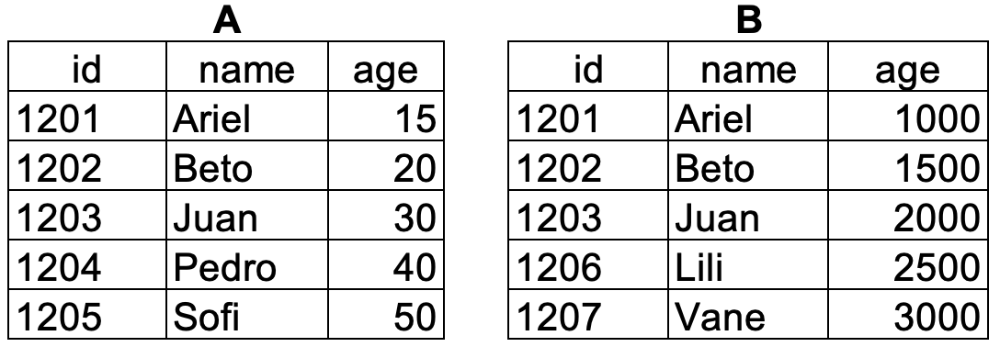
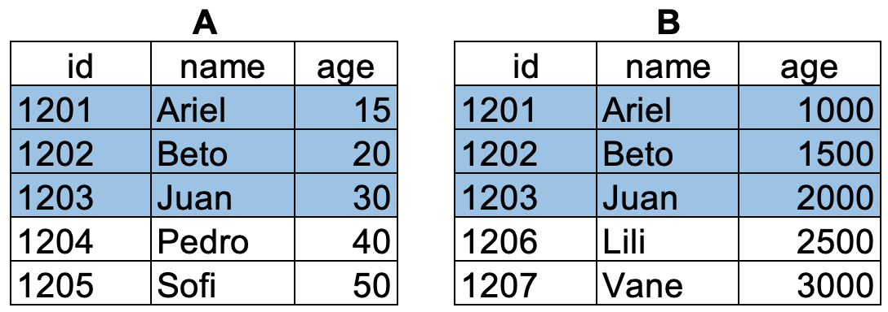
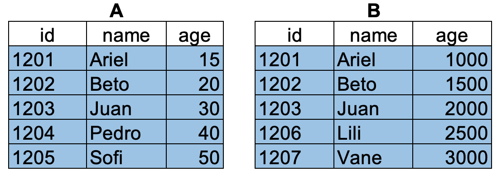
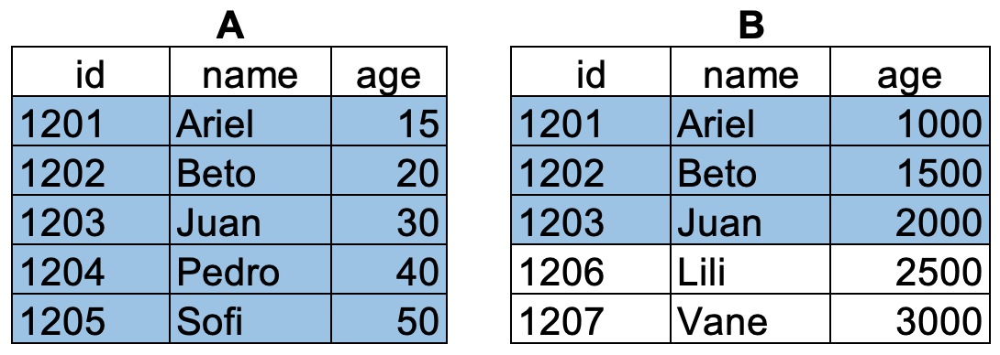
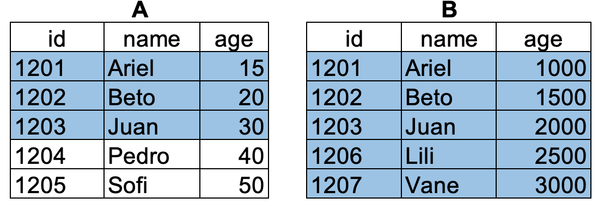

<!-- Estilo del HTML -->
<style type="text/css">
h1 {
  font-size: 32px;
  color: red
}
h1.title {
  font-size: 32px;
}
h2 {
  font-size: 30px;
}
h3 {
  font-size: 26px;
}
h4 {
  font-size: 24px;
}
p {
 font-size: 18px;
 color: black
}
li {
 font-size: 18px;
 color: black
}
.table th:not([align]) {
  text-align: left;
}
</style>
<!-- Estilo del HTML -->

<!-- Configuracion de la consola de R -->
```{r setup, include=FALSE}
knitr::opts_chunk$set(echo = T , eval = T , warning = T)
```

<!-- Bases de datos a usar como ejemplo -->
```{r, include=FALSE}
library('dplyr')
A = data.frame(id=c(1201,1202,1203,1204,1205),
               name=c("Ariel", "Beto","Juan","Pedro","Sofi"),
                age=c(15,20,30,40,50))

B = data.frame(id=c(1201,1202,1203,1206,1207),
               name=c("Ariel", "Beto","Juan","Lili","Vane"),
                wage=c(1000,1500,2000,2500,3000))
```

# 1. merge

La función ```merge``` permite unir 2 bases de datos usando una o un grupo de columnas (variables) como identificador de cada fila (observación).    


## 1.1. Argumentos de la funcion

```
x, y = dataframes u objetos a unir.

by, by.x, by.y	= columnas que vamos a usar como identificador para hacer el merge.

all, all.x , all.y = indica que observaciones se quieren mantener el objetos despues de hacer merge.	

suffixes = cadena de caracteres con un subindice para las columnas que se repiten en las dos bases.
```

## 1.2. Veamos un ejemplo

Supongamos que tenemos 2 dataframes llamados ```A``` y ```B```, que contiene la siguiente información:

{width=60%}

### 1.2.1 Observaciones que hacen ```match```

Si no empleamos ninguno de los argumentos ```all``` de la función, R asume que ```all=F``` y va a conservar las observaciones que hacen ```match``` en las dos bases de datos.

```{r}
merge(x = A,y = B,by="name")
```

Como tenemos dos variables que sirven como identificador en las dos bases de datos, R genera un identificador para cada una de las variables en la base de datos.

```{r}
merge(x=A,y=B,by=c("name","id"))
```

{width=60%}


### 1.2.2 Todas las observaciones

Cuando agregamos la opción ```all=T```, R va a conservar todas las observaciones en las dos bases de datos y va rellenar con ```NA``` las observaciones para las que no hay información en las dos bases de datos.

```{r}
merge(x=A,y=B,by=c("name","id"),all=T)
```

{width=60%}


### 1.2.3 Todas las observaciones de ```A```

Cuando agregamos la opción ```all.x=T```, R va a conservar todas las observaciones de ```A``` y va rellenar con ```NA``` las columnas de ```B``` para las que no hay información de ```A```.

```{r}
merge(x=A,y=B,by=c("name","id"),all.x=T)
```

{width=60%}

### 1.2.4 Todas las observaciones de ```B```

Cuando agregamos la opción ```all.x=T```, R va a conservar todas las observaciones de ```B``` y va rellenar con ```NA``` las columnas de ```A``` para las que no hay información de ```B```.

```{r}
merge(x=A,y=B,by=c("name","id"),all.y=T)
```

{width=70%}

## 1.3 Hacer merge de 2 bases de datos sin un ID unico


Supongamos que tenemos dos dataframe (```data_1```  y ```data_2```) que contienen información para tres individuos en diferentes periodos de tiempo. En ```data_1``` se puede observar a cada individuo en tres periodos de tiempo. En ```data_2``` solo observamos a los individuos  dos periodos de tiempo.

```{r, include=F}
data_1 = data.frame(id = c(rep(1,3),rep(2,3),rep(3,3)), month = rep(c(1,2,3),3) , wage = round(rnorm(n = 3*3,1000,100)))
data_2 = data.frame(id = c(rep(1,2),rep(2,2),rep(3,2)), date = rep(c(1,2),3)  , expenditure = round(rnorm(n = 3*2,500,50)))
```
```{r}
data_1
data_2
```

Si se queremos unir a ```data_1```  y ```data_2``` en un dataframe (```data_3```), deberíamos obtener máximo 9 observaciones. Sin embargo, si omitimos la variable de tiempo, pasa esto:

```{r}
data_3 = merge(x = data_1,y = data_2,by = 'id')
data_3
```

Se duplicaron las observaciones de ```data_1``` y hay 18 observaciones, todos los ```month``` se repiten para cada ```date```. Ahora debemos buscar la variable 

```{r}
# Veamos los duplicados por id y month en date_1
paste0(data_1$id,data_1$month) %>% duplicated() %>% table()

# Veamos los duplicados por id y date en date_2
paste0(data_2$id, data_2$date) %>% duplicated() %>% table()
```

Ahora hagamos el merge usando la variable de tiempo y el id del usuario

```{r}
data_4 = merge(x = data_1 , y = data_2 , by.x = c('id','month') ,by.y = c('id','date') , all.x = T)
data_4
```


# 2. rbind.fill

La función ```rbind.fill``` pertenece al paquete ```plyr```. Se usa para agregar observaciones a un dataframe usando el nombre de las variables (columnas) y llenando con ```NA``` las columnas que están ausentes en uno de los dos dataframes. Sigamos con el ejemplo de la base de datos ```data_1```  y ```data_2```.

```{r}
plyr::rbind.fill(data_1 , data_2)
```


