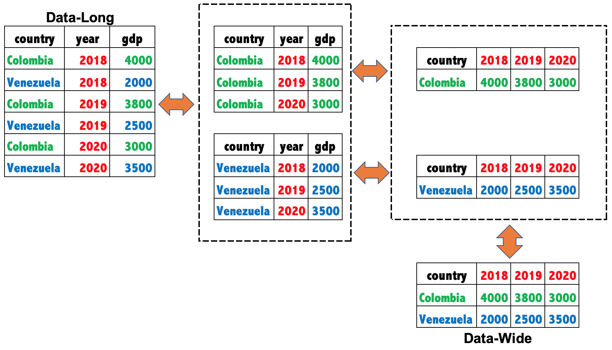

<!-- Estilo del HTML -->
<style type="text/css">
h1 {
  font-size: 32px;
  color: red
}
h1.title {
  font-size: 32px;
}
h2 {
  font-size: 30px;
}
h3 {
  font-size: 26px;
}
h4 {
  font-size: 24px;
}
p {
 font-size: 18px;
 color: black
}
li {
 font-size: 18px;
 color: black
}
.table th:not([align]) {
  text-align: left;
}
</style>
<!-- Estilo del HTML -->

<!-- Configuracion de la consola de R -->
```{r setup, include=FALSE}
knitr::opts_chunk$set(echo = T , eval = T , warning = T)
```

<!-- Bases de datos a usar como ejemplo -->
```{r, include=FALSE}
library('dplyr')
library('reshape2')
data_long = data.frame(country = c('Colombia','Venezuela','Colombia','Venezuela','Colombia','Venezuela'),
                       year = c(2018,2018,2019,2019,2020,2020),
                       gdp = c(4000,2000,3800,2500,3000,3500))
```

# 1. Trasponer bases de datos

{width=90%}

### 1.1. Transponer de ```long``` a ```wide```

Vamos a usar la función ```dcast``` del paquete ```reshape2```, para convertir las categorias de la columna ```year``` en las variables del nuevo dataframe. En el argumento ```data``` se escribe el df que queremos transponer, en el argumento ```formula``` se escribe del lado derecho la(s) variable(s) de ```'id'``` y en el lado izquierdo separado por ```~``` se escribe la(s) variable(s) que queremos trasponer. En el script de la clase veremos otros ejemplos.

```{r}
data_long
data_wide = reshape2::dcast(data = data_long, formula =  country ~ year , value.var="gdp")
data_wide
```


### 1.2. Transponer de ```wide``` a ```long```

Vamos a usar la función ```melt``` del paquete ```reshape2```, para convertir las variables ```2018:2020``` en una nueva columna de un dataframe. En el argumento ```data``` se escribe el df que queremos transponer, en el argumento ```id.vars``` se escribe la(s) variable(s) de ```'id'``` y en el argumento ```value.name``` el nombre que le queremos poner a la variable vamos a crear los valores. En el script de la clase veremos otros ejemplos.

```{r}
data_wide
reshape2::melt(data = data_wide,  id.vars=c("country") , value.name = 'gdp_pc')
```

### 1.3. Cuando tenemos que transponer un dataframe con "multiple values columns".

Sin embargo, cuando tenemos que transponer variables con multiples columnas que contienen valores, puede no ser tan simple.

 

Vamos a replicar este ejemplo de [stackoverflow](https://stackoverflow.com/questions/25143428/why-cant-one-have-several-value-var-in-dcast) (en casa).


