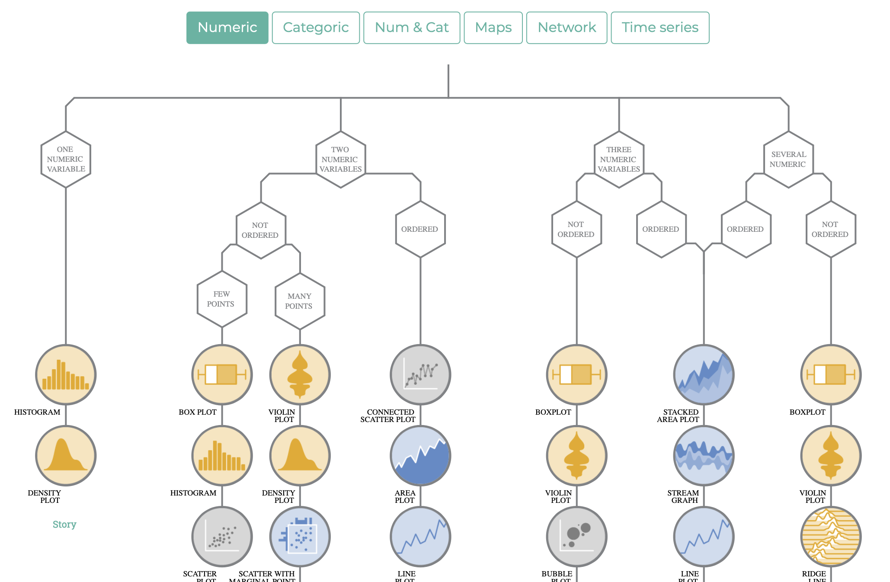

<!-- Estilo del HTML -->
<style type="text/css">
h1 {font-size: 32px;color: #00008B}
h1.title {font-size: 32px;}
h2 {font-size: 30px;color: #4169E1}
h3 {font-size: 26px;color: #4169E1}
h4 {font-size: 24px;}
 p {font-size: 22px; color: black}
li { font-size: 18px;color: black}
.table th:not([align]) {text-align: left;}
</style>

<!-- Configuración de la consola de R -->
```{r setup, include=FALSE}
knitr::opts_chunk$set(echo = T , eval = T , warning = T)
```

<!-- Bases de datos a usar como ejemplo -->
```{r, include=FALSE}
library('tidyverse')
library('viridis')
library('forcats')
```

# 1. Paquete ```ggplot2```

La librería ```ggplot2``` es de las mas usadas en la visualización de información en R. ```ggplot``` aporta una gran variedad de gráficos. Podemos encontrar una ayuda muy útil aquí:

* [Galeria de gráficos en R](https://www.r-graph-gallery.com)

* [From Data to Viz](https://www.data-to-viz.com/index.html) 

* [Tópicos](https://www.data-to-viz.com/caveats.html)

### 1.1. Argumentos de ```ggplot()```

```
data: base de datos
aes: se definen las características del gráfico (que se grafica en cada eje, los colores por grupo, etc.)
fill: Color con el que se rellena el elemento
colour: Color del borde del elemento
size: tamaño.
shape: indica la forma de los puntos (cuadrados, triángulos, etc.)
alpha: transparencia del color (entre 0 y 1)
```
Dentro de ```aes()```

```
x, y: valores a graficar en cada eje.
group: variable con la que se define el grupo de los elementos.
fill: variable con la que se define el color a rellenar usando las categorías de la variable.
colour: variable con la que se define el color del borde usando las categorías de la variable.
```

### 1.3. Como elegir el tipo de grafico?

Para hacer un gráfico usando R, generalmente se escribe ```ggplot() + tipo_grafico()``` donde ```tipo_grafico()``` es la función que usamos para pintar nuestros graficos. POr ejemplo, ```ggplot() + geom_point()``` nos pinta un grafico de dispersión. ```ggplot() + geom_histogram()``` nos pinta un histograma. ¿Pero que tipos de gráficos podemos visualizar en R? Depende de la naturaleza de la variable que queremos visualizar (numérica, categórica, numérica + categórica...).



### 1.4. Configurando mi grafico ```theme()```

Podemos configurar varios de los atributos de un gráfico desde el ```theme()```. Sin embargo, existen varios temas que han sido definidos y que ayudan a que el gráfico se vea mas bonito. Puede encontrar algunos ejemplos [aquí](https://ggplot2.tidyverse.org/reference/ggtheme.html).

De igual forma podemos modificar cualquier argumento de la funcion ```theme()```. Veamos todos los argumentos: [clic aquí](https://ggplot2.tidyverse.org/reference/theme.html)

