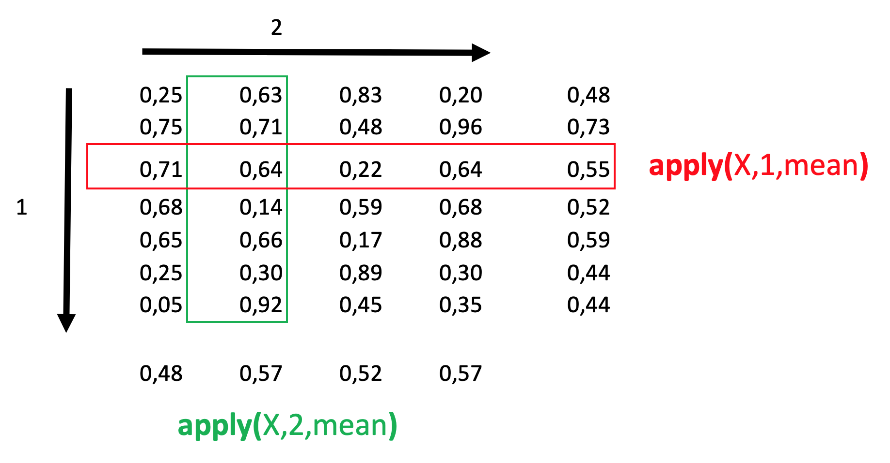

<!-- Estilo del HTML -->
<style type="text/css">
h1 {font-size: 32px;color: #00008B}
h1.title {font-size: 32px;}
h2 {font-size: 30px;color: #4169E1}
h3 {font-size: 26px;color: #4169E1}
h4 {font-size: 24px;}
 p {font-size: 22px; color: black}
li { font-size: 18px;color: black}
.table th:not([align]) {text-align: left;}
</style>

<!-- Configuración de la consola de R -->
```{r setup, include=FALSE}
knitr::opts_chunk$set(echo = T , eval = T , warning = T)
```

<!-- Bases de datos a usar como ejemplo -->
```{r, include=FALSE}
library('tidyverse')
library('kableExtra')

datos_vio = data.frame( cod_mpio = c(5001,5002,5003,5004,5005,5006),	
                        violencia_2014	= c(0.05,0.07,0.06,0.03,0.04,0.03),
                        violencia_2015	= c(0.09,0.05,0.03,0.06,0.03,0.01),
                        violencia_2016	= c(0.02,0.04,0.03,0.02,0.03,0.00),
                        violencia_2017	= c(0.03,0.06,0.03,0.01,0.04,0.01),
                        violencia_2018	= c(0.01,0.02,0.04,0.05,0.07,0.01),
                        violencia_2019  = c(0.01,0.02,0.02,0.03,0.03,0.01)
)
```

# 1. Loops: while, for, repeat. 

## 1.1 Qué es un loop?

* Un bucle o ciclo, en programación, es una secuencia que ejecuta repetidas veces por una instrucción/un trozo de código, hasta que la condición asignada a dicho bucle deja de cumplirse. Definición tomada de: [https://es.wikipedia.org](https://es.wikipedia.org)

* Los loops nos permiten iterar procesos y funciones a un mismo objeto.

* Un loop nos puede ayudar a ahorrar muchas líneas de código en nuestro editor de sintaxis (script).

## 1.2 Tipos de loop

* for 
* while
* repeat

## 1.2 Estructura de un loop


```
elementos para iterar: vector con elementos a iterar la sentencia del loop
sentencia: las acciones que se realizan dentro del loop
condicional: control de flujo para filtrar los elementos que cumplan la condición
```


### 1.3. Veamos un ejemplo de for

```{r,eval=F}
datos_vio
```
```{r,echo=F}
kbl(datos_vio) %>% kable_paper() %>% scroll_box(width = "700px", height = "300px")
```
```{r,eval=F}
for(i in 2:ncol(datos_vio)){
    datos_vio[,i] <- datos_vio[,i]*100
}
```


# 2. Controles de flujo (if, else, next, breack)

Los condicionales if y else los usamos para indicarle a R dentro de un loop que queremos que se aplique el statement o la sentencia solo a los elementos que cumplen la condición y a para los demás elementos los pasa por alto.


# 3. Funciones apply, lapply y sapply


# apply()

Podemos usar esta función para aplicar operaciones a filas y/o columnas de un dataframe. Como resultado obtenemos un objeto de tipo vector, lista o array. La función tiene tres argumentos, X = objeto, MARGIN = 1 si quiero hacer las operaciones por filas y a 2 si quiero hacer las operaciones por columnas y el argumento FUN = a la función que quiero aplicarles a las filas y/o columnas. (ver imagen)



# lapply() y sapply()

Podemos usar ```lapply()``` para aplicar operaciones a las columnas de un dataframe, los elementos de un vector o los elementos de una lista. Como resultado obtenemos una lista. 

{width=70%}


