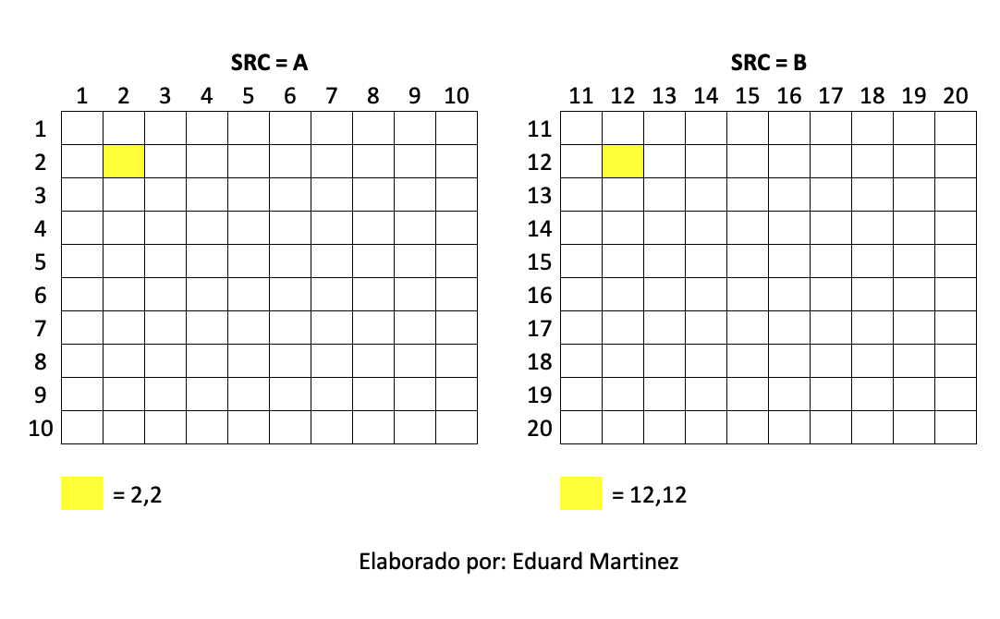
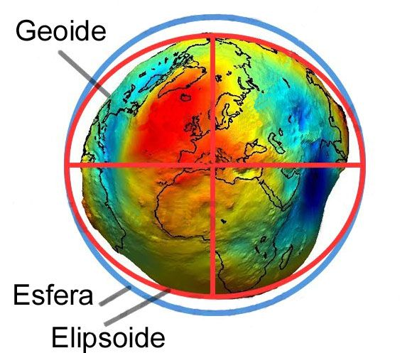
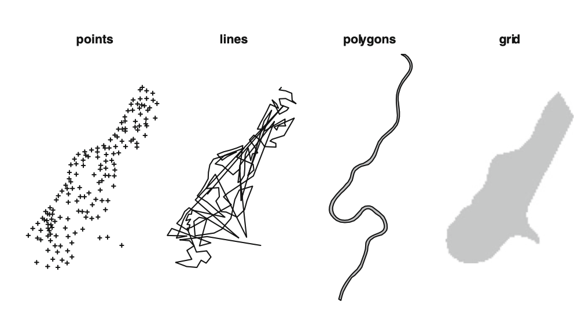

<!-- Estilo del HTML -->
<style type="text/css">
h1 {font-size: 32px;color: #00008B}
h1.title {font-size: 32px;}
h2 {font-size: 30px;color: #4169E1}
h3 {font-size: 26px;color: #4169E1}
h4 {font-size: 24px;}
 p {font-size: 20px; color: black; text-aling:justify}
li { font-size: 18px;color: black}
.table th:not([align]) {text-align: left;}
</style>

<!-- Configuración de la consola de R -->
```{r setup, include=FALSE}
knitr::opts_chunk$set(echo = T , eval = T , warning = T)
```

<!-- Bases de datos a usar como ejemplo -->
```{r, include=FALSE}
library('tidyverse')
library('kableExtra')
```

# 1. ¿Que es un SIG?

Un Sistema de información Geografico (SIG) permite relacionar cualquier tipo de dato con una ubicacion geografica. Es decir, permite visualizar la distribucion espacial de casi cualquier variable (ingresos, homicidios...) al nivel geografico que se tiene la información (casa, manzana, barrio, municipio, departamento, pais...)

# 2. El Sistema de Referencia de Coordenadas (SRC) 

Todo objeto espacial está asociado a un sistema de coordenadas. El sistema de coordenadas, junto con la tolerancia y los valores de resolucion, constituye una referencia  espacial de una clase de entidad. Podemos encontrar entre otros los siguientes tipos de SRC:

### 2.1. Sistema de Coordenadas Geograficas

El uso de Sistemas de Referencia de Coordenadas geograficas es muy comun. Utilizan los grados de latitud y longitud y en ocasiones un valor de altitud para definir la situacion de un punto sobre la superficie terrestre. La latitud se encuentra definida entre -90 y +90 grados, mientras que la longitud se encuentra definida entre -180 y +180 grados. El Sistema Geodesico mas popular se denomina WGS84 (World Geodetic System 1984). Podemos encontrar dos formas de escribir coordenadas esféricas, en grados decimales y usando grados-minutos-segundos (DMS). Por ejemplo, el centro de Nueva York puede expresarse como: 

* **Usando DMS:**
- Latitud: 40 grados, 42 minutos, 51 segundos N
- Longitud: 74 grados, 0 minutos, 21 segundos O

* **Usando grados decimales:**
- Latitud: 40.714
- Longitud: -74.006

Ejemplo tomado de: [https://acolita.com](https://acolita.com/grados-minutos-segundos-dms-vs-grados-decimales-dd/)

### 2.2. Sistema de referencia de coordenadas proyectado

Un sistema de referencia de coordenadas bidimensional se define normalmente mediante dos ejes. Ubicados en angulo recto uno respecto al otro, forman el denominado plano XY. Estos coordenadas suelen representarse usando metros. 

Mas información [aquí](https://docs.qgis.org/2.14/es/docs/gentle_gis_introduction/coordinate_reference_systems.html)


# 3. Elementos de un CRS

**Nota:** hacer salvedad...

### 3.1. DATUM y Elipsoide

El Datum sirve para hacer que un Sistema de Coordenadas Geograficas represente fielmente la superficie de la Tierra y salve las irregularidades de la misma, ya que esta no es esferica. Aunque existe un Datum  global, cada continente o pais ha definido su propio Datum para adaptar mejor el Sistema de Coordenadas  Geograficas a su superficie. Por tanto, las coordenadas geograficas no suelen ser universales, sino que  son relativas al Datum de referencia elegido. De esta manera, un mismo punto se expresa con coordenadas geograficas diferentes en funcion del Datum seleccioando. Definición tomada de [https://www.aristasur.com](https://www.aristasur.com/contenido/que-es-el-datum-de-las-coordenadas-geograficas-y-su-uso-en-el-gps). 

{width=70%}

Debido a esta irregularidad de la superficie terrestre, para describir la forma de la Tierra suelen utilizarse modelos de la misma denominados esferoides o elipsoides de referencia. Definición tomada de [https://www.um.es](https://www.um.es/geograf/sigmur/temariohtml/node5_mn.html).

{width=50%}

# 4. ¿En que formato podemos encontrar la información espacial?
 
* Shapefiles
* .gpkg
* .mtd
* .KML
* .tiff
* .nc y .nc4
* Otros...

# 5. Extenciones de un archivo shapefile
* shp: es el archivo principal que almacena la geometria de la entidad; necesario.
* shx: es el archivo de indice que almacena el indice de la geometría de la entidad; necesario.
* dbf: almacena el dataframe con los atributos de la entidad; necesario.
* prj: es el archivo que almacena información del CRS.
  
Mas información [aquí](http://desktop.arcgis.com/es/arcmap/10.3/manage-data/shapefiles/shapefile-file-extensions.htm).

# 6. Clases de objetos espaciales 

1. Vectoriales (Mas información [aquí:](https://docs.qgis.org/2.14/es/docs/gentle_gis_introduction/vector_data.html))

1.1. Poligonos

1.2. Puntos 

1.3. Lineas o arcos

2. Raster  (Mas información [aquí:](https://docs.qgis.org/2.14/es/docs/gentle_gis_introduction/raster_data.html)) 



# 7. ¿Donde encuentro información espacial libre?

* Marco Geoestadístico Nacional [MGN-DANE](https://geoportal.dane.gov.co/servicios/descarga-y-metadatos/descarga-mgn-marco-geoestadistico-nacional/)

* Sistema de Información Ambiental de Colombia [SIAC](http://www.siac.gov.co/geovisorconsultas)

* Sistema de Información Geográfica para la planeación y el Ordenamiento Territorial [SIG-OT](http://sigotvg.igac.gov.co:8080)

* Datos abiertos Bogotá [https://datosabiertos.bogota.gov](https://datosabiertos.bogota.gov.co/dataset)

* Medellin [https://www.medellin.gov.co](https://www.medellin.gov.co/geomedellin/index.hyg)

* Otras secretarias tienen información espacial online. 
